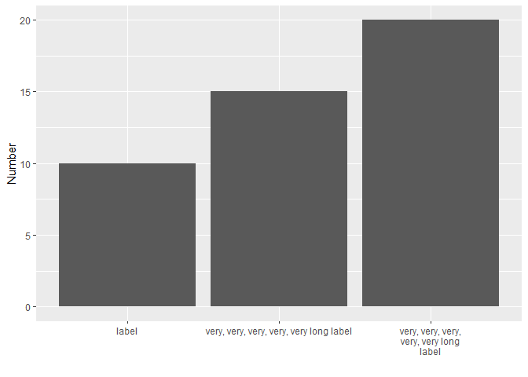
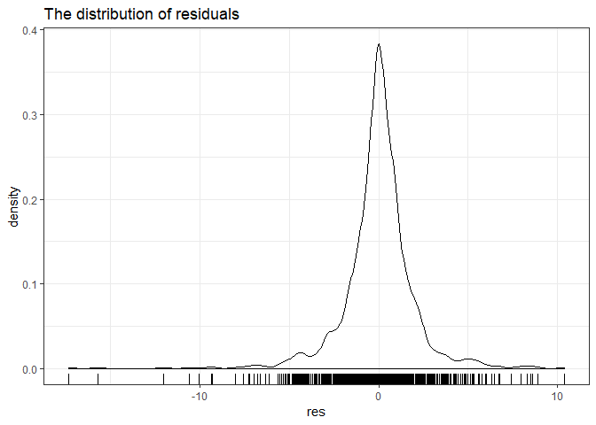
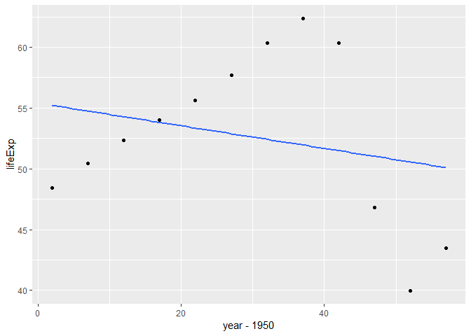

hw06: Data Wrangling
================

In this assignment I mainly explored some basic functions of stringr
which are common but useful in many cases, and performed
split-apply-combine strategy with the `gapminder` dataset.

A quick navigation:

  - [Character data](#character-data)
      - [Paste](#paste)
      - [Combination](#combination)
      - [Extraction](#extraction)
      - [Wrapping](#wrapping)
      - [Trim and pad](#trim-and-pad)
  - [Work with a nested data frame](#work-with-a-nested-data-frame)
      - [Split by nesting](#split-by-nesting)
      - [Apply a function](#apply-a-function)
      - [Combine and simplyfy](#combine-and-simplyfy)
      - [Explore the residuals](#explore-the-residuals)

<!-- end list -->

``` r
library(stringr)
library(ggplot2)
library(gapminder)
suppressPackageStartupMessages(library(tidyverse))
```

## Character data

### Paste

> 1.  In code that doesn’t use stringr, you’ll often see `paste()`
>     and`paste0()`. What’s the difference between the two functions?
>     What stringr function are they equivalent to? How do the functions
>     differ in their handling of `NA`?

Try to combine the strings “Hello” and “world”.

``` r
paste("Hello","world")
```

    ## [1] "Hello world"

``` r
paste("Hello","world",sep = "@")
```

    ## [1] "Hello@world"

``` r
paste0("Hello","world")
```

    ## [1] "Helloworld"

From the above, we could see that `paste()` function adds separate
character (default with a space " ") when combining two strings. Whereas
`paste0()` function combines strings without space. `str_c()` is kind of
like a cross between these two functions. You could use it directly or
use the `sep` argument to control how the strings are separated:

``` r
str_c("Hello","world") # like `paste0`
```

    ## [1] "Helloworld"

``` r
str_c("Hello","world",sep = "@") # like `paste`
```

    ## [1] "Hello@world"

What if one string is `NA` here?

``` r
x <- c("abc", NA)
str_c("|-", x, "-|")
```

    ## [1] "|-abc-|" NA

``` r
paste("|-", x, "-|")
```

    ## [1] "|- abc -|" "|- NA -|"

As shown above, both `str_c()` and `paste()` are vectorised, but the
missing value `NA` would not be operated in `str_c()`.

### Combination

> 2.  In your own words, describe the difference between the `sep` and
>     `collapse` arguments to `str_c()`.

If there are two or more arguments of string, choose `sep`. If the
strings are stored in a vector like the following example, use
`collapse` instead.

``` r
str_c(c("Hello", "world"), collapse = "@")
```

    ## [1] "Hello@world"

### Extraction

> 3.  Use `str_length()` and `str_sub()` to extract the middle character
>     from a string. What will you do if the string has an even number
>     of characters?

Let’s define a function that extract the middle character from a string
no matter its length is odd or even. By the trick of `ceiling`, we could
find the median of the length.

``` r
str_mid_char <- function(x){
  str_sub(x, ceiling(str_length(x)/2), ceiling((str_length(x)+1)/2))
}
str_mid_char("apple") # odd number of characters
```

    ## [1] "p"

``` r
str_mid_char("banana") # even number of characters
```

    ## [1] "na"

### Wrapping

> 4.  What does `str_wrap()` do? When might you want to use it?

`str_wrap()` allows the control of output format, i.e., wrapping strings
into nicely formatted paragraphs, with the arguments of `width`,
`indent` and `extent`. Inspired by the reply from our TA in [one post of
github
discussion](https://github.com/STAT545-UBC/Discussion-Internal/issues/61#issuecomment-435173377),
I decided to explore how this function works with a long axis label when
visulization. Just make a silly example as below. The second label
decreases the readability and aesthetic of the axis because of the
length of string. By the help with `str_wrap()`, the problem of format
is solved.

``` r
long_label <- "very, very, very, very, very long label"
fixed_label <- str_wrap(long_label, width = 20)
df = data.frame(x = c("label", long_label, fixed_label), y = c(10, 15, 20)) # compare two strings in one axis 

ggplot(df, aes(x, y)) + 
  xlab("") + ylab("Number") +
  geom_bar(stat = "identity")
```

<!-- -->

### Trim and pad

> 5.  What does str\_trim() do? What’s the opposite of str\_trim()?

`str_trim()` is used to remove whitespace from start and end of string.
For example:

``` r
(a <- "   Hello world\t")
```

    ## [1] "   Hello world\t"

``` r
str_trim(a)
```

    ## [1] "Hello world"

Just notice that the space between the words is kept.

`str_pad()` works in an opposite way from this function.

``` r
(a <- "Hello world")
```

    ## [1] "Hello world"

``` r
str_pad(a, width = 20, side = "both")
```

    ## [1] "    Hello world     "

Of course, you could change the padding character with the argument
`pad`.

## Work with a nested data frame

This section is inspired by the [split-apply-combine lesson from Jenny
Bryan](http://stat545.com/block024_group-nest-split-map.html). It refers
to get apply a computation to all the pieces of a dataset and glue the
results back together. In this way we could compute or graph these
results more concisely. By this strategy, I tried to figure out the
countries whose life expectancy has a sudden and large deviation from
the general trend over years.

### Split by nesting

Nesting can be used to support more complex group-wise computation. When
you nest data, the non-grouping variables are packaged into
group-specific data frames that are held in a special variable called a
list-column. I didn’t use `kable()` since I wanted to show the structure
of list-column.

``` r
(gap_nested <- gapminder %>% 
  group_by(continent, country) %>% 
  nest()) # nest the data by country and continent
```

    ## # A tibble: 142 x 3
    ##    continent country     data             
    ##    <fct>     <fct>       <list>           
    ##  1 Asia      Afghanistan <tibble [12 x 4]>
    ##  2 Europe    Albania     <tibble [12 x 4]>
    ##  3 Africa    Algeria     <tibble [12 x 4]>
    ##  4 Africa    Angola      <tibble [12 x 4]>
    ##  5 Americas  Argentina   <tibble [12 x 4]>
    ##  6 Oceania   Australia   <tibble [12 x 4]>
    ##  7 Europe    Austria     <tibble [12 x 4]>
    ##  8 Asia      Bahrain     <tibble [12 x 4]>
    ##  9 Asia      Bangladesh  <tibble [12 x 4]>
    ## 10 Europe    Belgium     <tibble [12 x 4]>
    ## # ... with 132 more rows

### Apply a function

The objective is to find the countries with outliers in life expectancy.
So firstly write a function that fit a model of life expectancy against
year, and return the residuals to detect countries where the model is a
terrible fit.

``` r
le_vs_yr <- function(df) {
  lm(lifeExp ~ I(year - 1950), data = df)$residuals # return residuals of the fitted model 
}
```

Use `purrr::map()` to apply the fitting function `le_vs_yr()` to all the
countries and store the results into new list-column with `mutate()`.

``` r
(gap_res <- gap_nested %>% 
  mutate(res = map(data, le_vs_yr)) %>% # fit the model with every country
  select(continent, country, res)) 
```

    ## # A tibble: 142 x 3
    ##    continent country     res       
    ##    <fct>     <fct>       <list>    
    ##  1 Asia      Afghanistan <dbl [12]>
    ##  2 Europe    Albania     <dbl [12]>
    ##  3 Africa    Algeria     <dbl [12]>
    ##  4 Africa    Angola      <dbl [12]>
    ##  5 Americas  Argentina   <dbl [12]>
    ##  6 Oceania   Australia   <dbl [12]>
    ##  7 Europe    Austria     <dbl [12]>
    ##  8 Asia      Bahrain     <dbl [12]>
    ##  9 Asia      Bangladesh  <dbl [12]>
    ## 10 Europe    Belgium     <dbl [12]>
    ## # ... with 132 more rows

### Combine and simplyfy

The last step is now to simplify, preferably back to a normal tibble. We
do this by retaining variables that are amenable to simplification and
using `unnest()`, thus completing the circle.

``` r
gap_res <- unnest(gap_res)

gap_res %>% 
  sample_n(10) %>% 
  knitr::kable()
```

| continent | country     |         res |
| :-------- | :---------- | ----------: |
| Africa    | Ethiopia    |   0.8022133 |
| Africa    | Somalia     |   1.3923998 |
| Africa    | Angola      |   0.1467517 |
| Europe    | Ireland     | \-0.4894510 |
| Africa    | Mauritania  |   0.3156107 |
| Europe    | Switzerland |   0.0547086 |
| Oceania   | Australia   |   0.5832984 |
| Africa    | Namibia     |   4.8987576 |
| Europe    | Finland     | \-0.1486002 |
| Americas  | Argentina   |   0.0661445 |

### Explore the residuals

Finally we could have a look on the residuals of fitted models. Through
the efforts above, `gap_res` is handy for numerical summarization and
visualization.

``` r
summary(gap_res$res)
```

    ##      Min.   1st Qu.    Median      Mean   3rd Qu.      Max. 
    ## -17.30969  -0.74149   0.04888   0.00000   0.84959  10.38549

The numerical summaries look reasonable. The points from the first
quartile to the third quartile are well fit in the model. We conclude
with a look at the full distribution.

``` r
ggplot(gap_res, aes(x = res)) +
  geom_density() + 
  geom_rug() +
  ggtitle("The distribution of residuals") +
  theme_bw()
```

<!-- -->

As shown in the graph, most points locate between -10 and 10. Let’s find
the countries with far outliers.

``` r
gap_res %>% 
  filter(abs(res)>10) %>% # filter the outliers
  knitr::kable()
```

| continent | country   |        res |
| :-------- | :-------- | ---------: |
| Asia      | Cambodia  | \-15.69299 |
| Africa    | Lesotho   | \-10.04314 |
| Africa    | Rwanda    | \-17.30969 |
| Africa    | Swaziland | \-12.00397 |
| Africa    | Zimbabwe  |   10.38549 |
| Africa    | Zimbabwe  | \-10.58119 |

We can conclude that Cambodi, Lesotho, Rwanda, Swaziland and Zimbabwe
have seen a huge fluctuation in their trend of life expectancy. Take
Zimbabwe as an example.

``` r
gapminder %>% 
  filter(country == "Zimbabwe") %>% 
  ggplot(aes(x = year-1950, y = lifeExp)) +
  geom_smooth(se = FALSE, method = lm) + # fit linear regression
  geom_point()
```

<!-- -->
